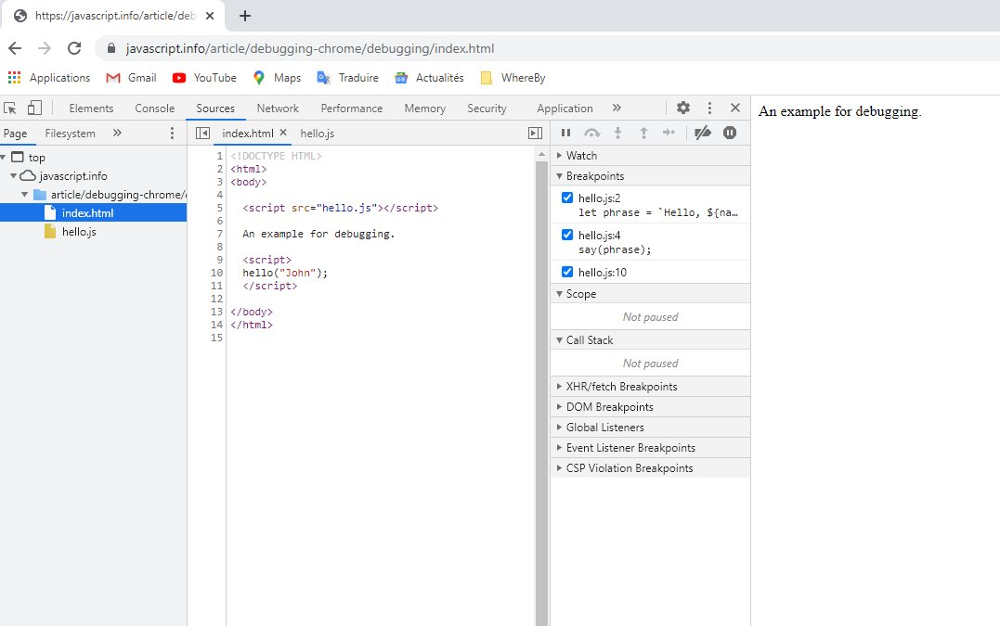

# Debugger dans Chrome

Les outils de dev s'ouvrent avec `F12` ou `Ctrl+Shift+I`

Ouvrir la [page d'exemple](https://javascript.info/article/debugging-chrome/debugging/index.html)

## Le panneau "Sources"

Le boutton  ouvre un onglet contenant les fichiers sources



Le panneau `Sources` contient 3 parties :

- le `File Navigator` liste les fichiers HTML, Javascript, CSS et autres incluant des images dans la page. Les extensions Chrome peuvent également apparaître ici.

- le `Code Editor` montre le code source

- l'onglet `Javascript Debugging` détaillé ci-après...

## La Console

S'ouvre avec `Esc` et permet d'exécuter du code

## Les Breakpoints

Se placent dans les fichiers dans le `Code Editor` et accessibles dans le `Javascript Debugging`, on peut :

- repérer les bp en cliquant dessus depuis le debbuger,

- (dés)activer un pb en checkant dessus

- retirer un pb avec click-droit/remove...

- placer des pb conditionnels avec click-droit dans le `Code Editor`

## La commande `debugger`

```js
function hello(name) {
  let phrase = `Hello, ${name}!`;

  debugger; // <-- the debugger stops here

  say(phrase);
}
```

## debugger...


dans l'onglet `Javascript Debugging` on peut examiner l'état du code courant :

- `watch` = montre les valeurs courante de toute expression

  ajouter une expression avec le +

- `Call Stack` = montre la chaîne d'appels en cliquant sur chaque appel
- `Scope` = variables `Locales` et `Globales` courantes

## Tracer l'exécution


<span style="color:red">1.</span> `Resume` = continue l'exécution jusqu'au prochain `breakpoint` <kbd>F8</kbd>

<span style="color:red">5.</span> `Step` = va à la commande suivante <kbd>F9</kbd>

<span style="color:red">2.</span> `Step over` = va à la commande suivante, mais ne rentre pas dans une fonction du code (pas les built-in comme `alert` par exemple) <kbd>F10</kbd>

<span style="color:red">3.</span> `Step into` = va à la commande suivante, et prend en compte les fonctions asynchrones <kbd>F11</kbd>

<span style="color:red">4.</span> `Step out` = continue l'exécution jusqu'à a fin de la fonction courante <kbd>Shift+F11</kbd>

<span style="color:red">6.</span> active/désactive les points d'arrêt

<span style="color:red">7.</span> active/désactive les pauses automatiques en cas d'erreur
