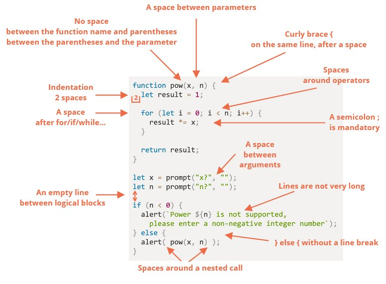

# Style du code

Pour que le code soit lisible et compréhensible par tous les devs...

## Syntaxe



## Guides

Le plus connu est [StandardJS](https://standardjs.com/)

## Linters

Outils qui checkent automatquement le code et le formattent

- [JSLint](http://www.jslint.com/) un des premiers,
- [JSHint](http://www.jshint.com/) plus configurable que JSLint,
- [ESLint](http://www.eslint.org/) probablement le plus récent :

  -> installer avec <kbd>npm install -g eslint</kbd>

  -> installer le plugin dans l'éditeur

  -> écrire un fichier `.eslintrc` à la racine du projet

  ```js
  {
    "extends": "eslint:recommended",
    "env": {
      "browser": true,
      "node": true,
      "es6": true
    },
    "rules": {
      "no-console": 0,
      "indent": 2
    }
  }
  ```

  `"extends": "eslint:recommended"` signifie qu'on hérite de la config de base

  les lignes suivantes complètent la config
